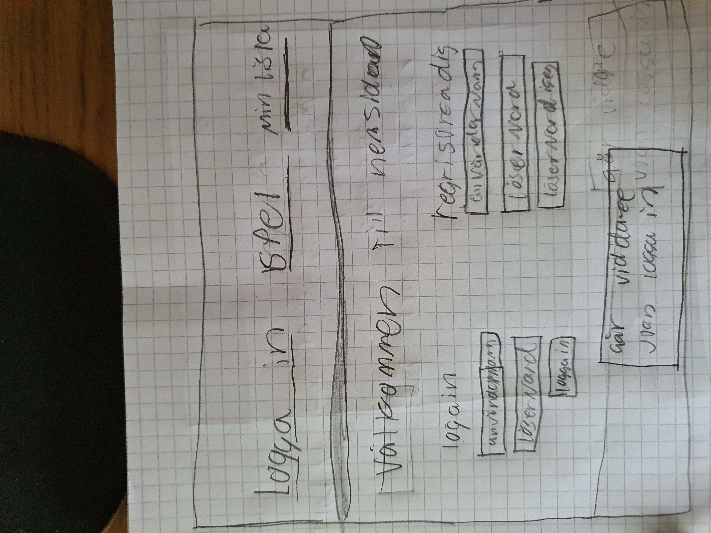
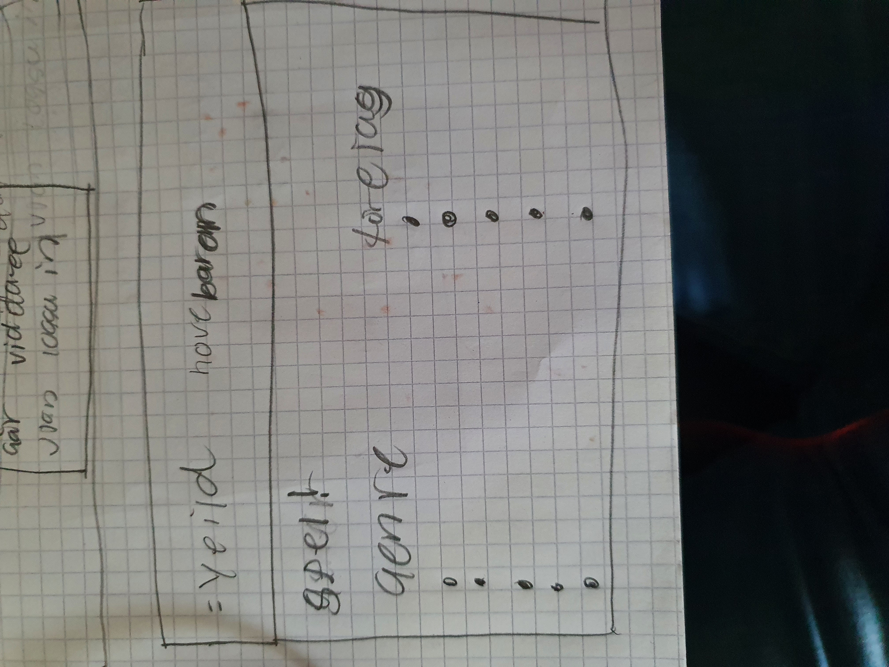
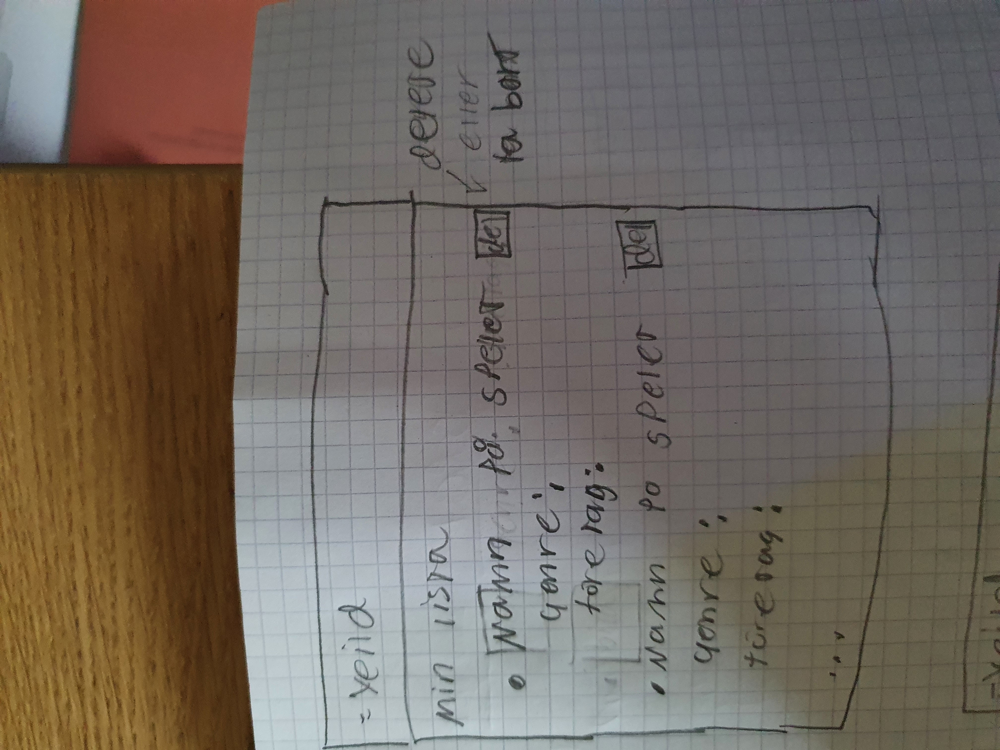
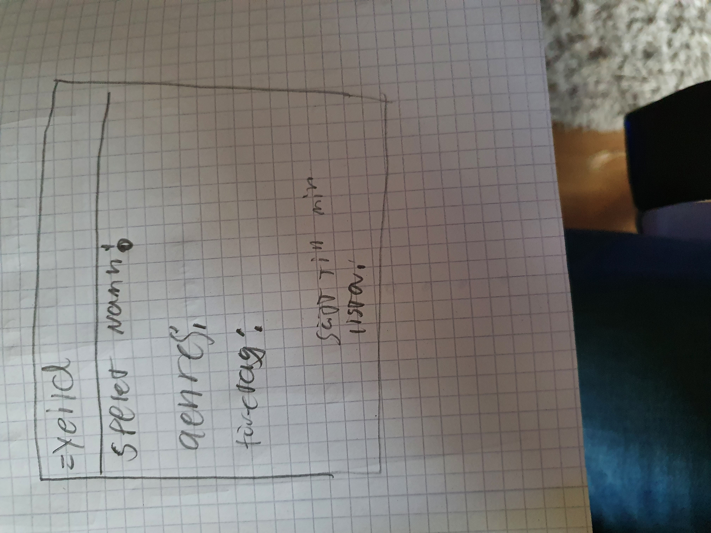
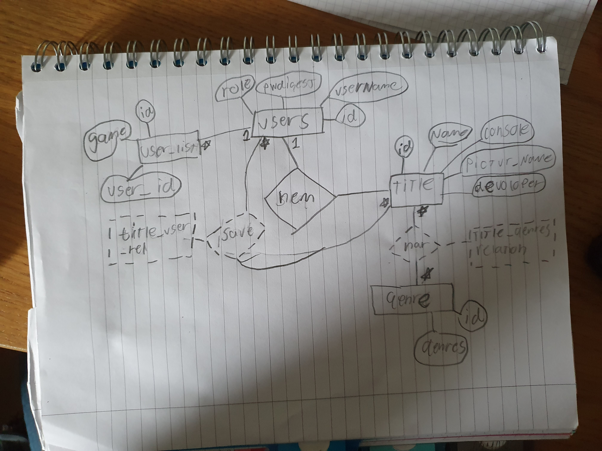

# Projektplan

## 1. Projektbeskrivning (Beskriv vad sidan ska kunna göra).
Denna sida ska kunna visa upp spel av flera olika genre och företag under samma kategorier för att kunna hitta liknade spel eller spel av samma företag. Vilket då ska ge användaren en bra förstålse vilka spel han kanske också gillar. Sidan ska man kunna logga in och registrera sig på hemsidan. Men loggar man inte in så kan man fortfarande kolla påhemsidan fast man kan inte göra dess funktioner eller liknade. Där inlågare kommer ha funktioner att kunna göra så som man kan markera dem spelen man gillar och genre man gillar att spela vilket kommer upp i sin lista efter ått. Där spelen kommer visa vilket gengre dem är, samt vilket företag som har gjort dem.    
## 2. Vyer (visa bildskisser på dina sidor).
Första bilden är start sidan man kommer in på när man startar hemsidan 

Denna bild kommer efter man har loggat in för att välja vilket genre eller företag man vill kolla på!
Yeild är samma som houvdbaren från första bilden!!

Denna bild är på sin lista man kan se sina favoriter

Denna bild är på spelet information när man klickar på den 

## 3. Databas med ER-diagram (Bild på ER-diagram).
Mitt ER diagram på hemsidan 

## 4. Arkitektur (Beskriv filer och mappar - vad gör/innehåller de?).

[Planeringss_bilder] Innehåller alla bilder av planeringen av projektet, samt er digramen de första och den andra mer upptaterade.

